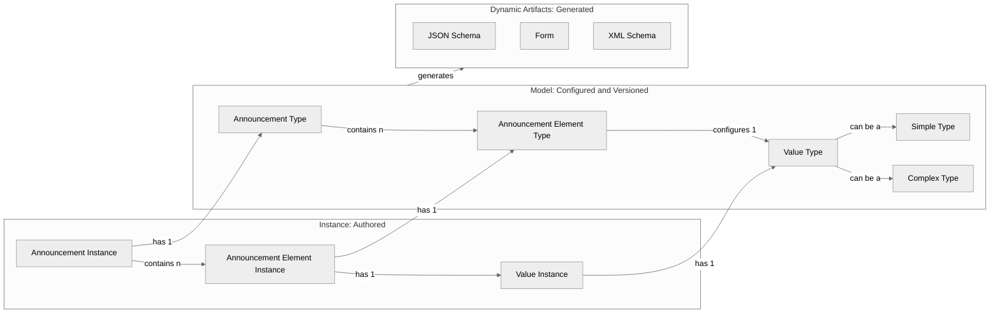
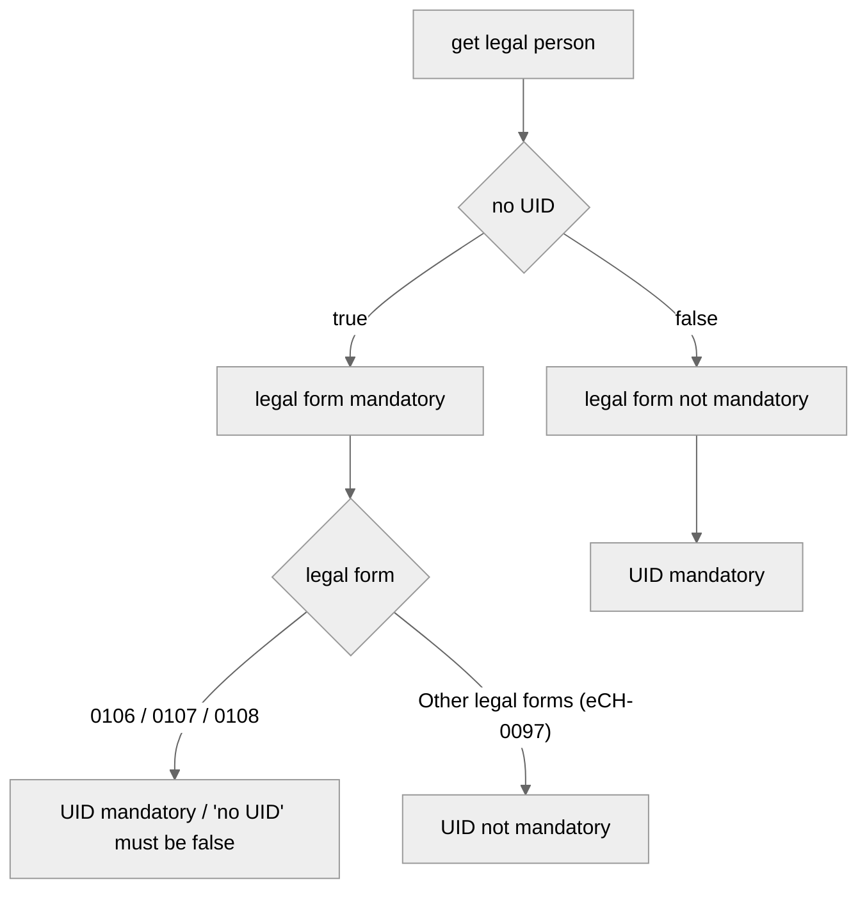

# Announcement Model
The following sections explain the basic idea behind an announcement type on ePublication, its standardization, how it works, and how it fits into the overall context.

## Overview ##

The big picture

The configuration is based on three artefacts:
- The data types
- The terms catalog
- The configuration of an announcement type

Each announcement type (synonymous with entry form on the GUI) consists of various elements (representing one or more input fields on the form).

## The data types ##

The data type set consists of complex and simple data types. Complex data types are:
- person (can be natural or legal persons)
- natural person
- legal person
- address
- dateFromTo

Simple types are:
- string
- int
- date
- duration
- time

> [!NOTE]
> The data type set is stored statically in the system and cannot be changed.

### The Business Rules ###

The static types can contain general business cases and constraints. These are continuously supplemented and described here.

**Legal Person**

Business Rule "Mandatory UID" in Legal Person:
Under certain circumstances, the UID number is mandatory for legal persons. The following flowchart describes in which cases a UID number is mandatory.

## The terms catalog ##

The catalog of terms contains all specialized terms related to official announcements. The structure of the catalog is very straightforward and consists only of a key and a general description of the term.
However, the list is conclusive, which means that if, for example, announcements are imported via the API, only elements with a valid key can be imported.

## The configuration of an announcement type ##

The configuration of a notification type contains all necessary configurations and defines the actual content of a notification (in the form of a business case).
In the configuration of the business case, elements are defined using terms from the term catalog and typed using the types from the type schema.

