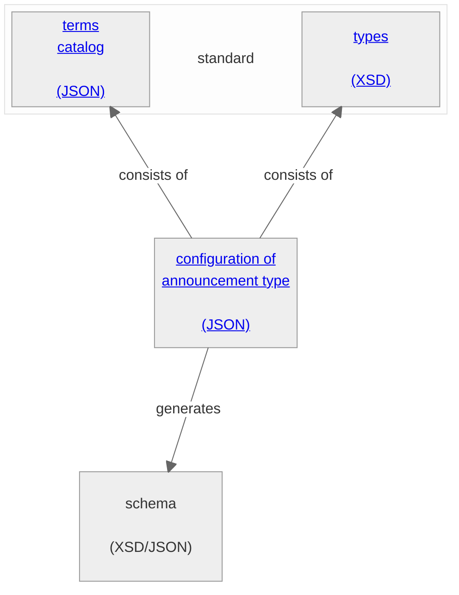

# Announcement model
The following sections describe the announcement model for a publication on ePublication.ch

The configuration is based on three artefacts:
- The data types
- The technical expressions
- The configuration of an announcement type

**The data types**

xx

**The technical expresions**

xx

**The configuration of an announcement type**

xx
