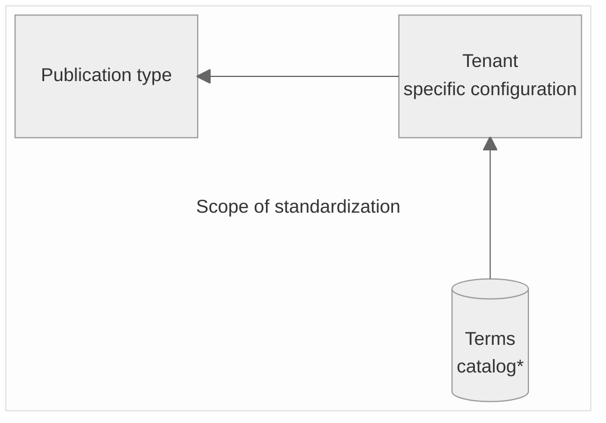

# announcement

```mermaid

%%{
  init: {
    'theme': 'neutral'
  }
}%%

block-beta

block:scope["Scope of standardization"]

columns 3
standard["Publication type"]:1
space Terms["Tenant
specific configuration"]
space:3
space space termDB[("
Terms
catalog*")]

end


Terms --> standard
termDB --> Terms
```
