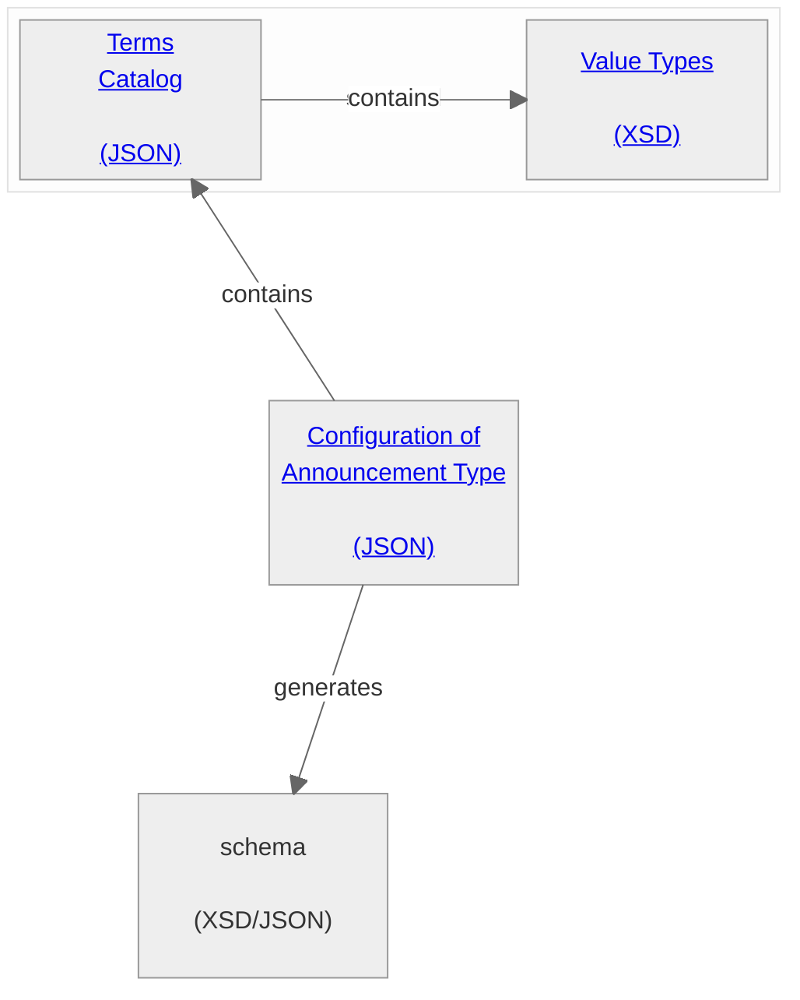
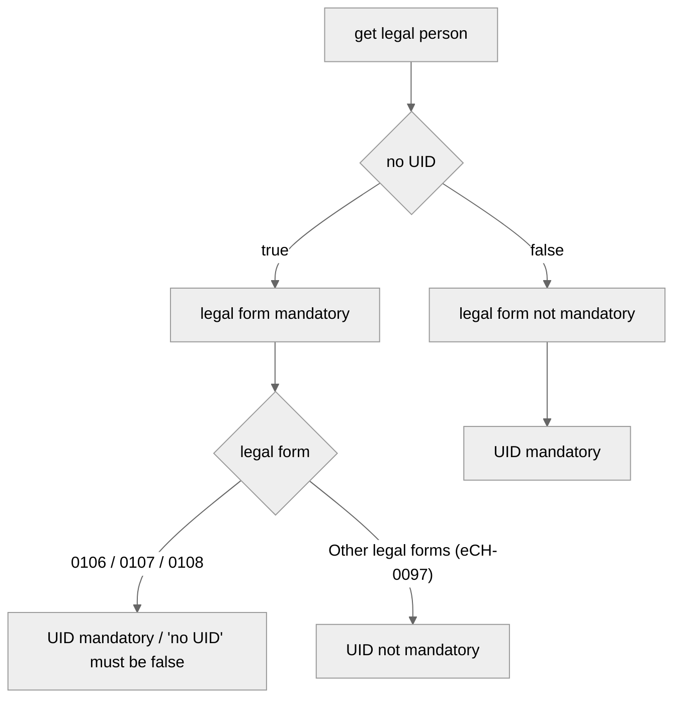

# Announcement Model
The following sections explain the basic idea behind an announcement type on ePublication, its standardization, how it works, and how it fits into the overall context.

## The Artefacts in this repository ##

The configuration is based on three artefacts:
- The value types
- The terms catalog
- The configuration of an announcement type

Each announcement type (synonymous with entry form on the GUI) consists of various elements (representing one or more input fields on the form).

## The value types ##

The data type set consists of complex and simple value types. Value types can contain rules, the value types and the associated rules are explained in the next section

### Person ###
Person can be a natural or a legal person. The person type should be used when either natural or legal person is possible.

### Natural Person ###
The schema for a natural person should comply with eCH standard 0044, specifically the complexType “personIdentificationLightType". Further information see https://www.ech.ch/de/ech/ech-0044/4.1.

### Legal Person ###
The schema for a legal person entity should follow the eCH standard 0097. For further information, see: https://www.ech.ch/de/ech/ech-0097/5.2.0

Business Rule "Mandatory UID" in Legal Person:
Under certain circumstances, the UID number is mandatory for legal persons. The following flowchart describes in which cases a UID number is mandatory.

### Address ###
Should follow the eCH standard for postal addresses: https://www.ech.ch/de/ech/ech-0010/5.0

### Date From-To ###
Describes an absolute period of time with a start date and an end date.

------------------
Simple types are:
### String ###
Describes a text value. Can be a single or multiline text field, including a rich text field.

### Int ###
Describes an integer.

### Date ###
Describes a date.

### Time ###
Describes a time of day from 00:00:00 to 23:59:59.

### DateTime ###
Combines date and time.

### Duration ###
Describes a period of time in the form of an absolute integer, which can be days or months.

### URL ###
Describes a reference to a URI.

### Enumeration ###
Describes a conclusive list of several values.

### Select ###
Used to describe a Boolean switch. Possibly unnecessary.

### Attachment ###
Describes attachments, the type and manner is to be clarified.

-----------------------------------
> [!NOTE]
> The value type set is stored statically in the system and cannot be changed.

-----------------------------------

## The terms catalog ##

The catalog of terms contains all specialized terms related to official announcements. The structure of the catalog is very straightforward and consists only of a key and a general description of the term.
However, the list is conclusive, which means that if, for example, announcements are imported via the API, only elements with a valid key can be imported.

## The configuration of an announcement type ##

The configuration of a notification type contains all necessary configurations and defines the actual content of a notification (in the form of a business case).
In the configuration of the business case, elements are defined using terms from the term catalog and typed using the types from the type schema.

