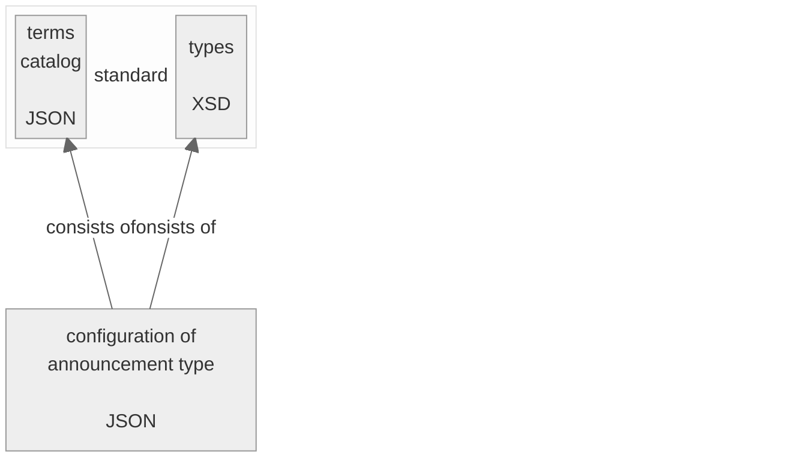

# Announcement model
The following manual describes how an announcement is configured on the ‘ePublication’ platform.

```mermaid

%%{
  init: {
    'theme': 'neutral'
  }
}%%

block-beta
columns 3

block:scope["standard"]

terms["terms
catalog

JSON"]:1
space
standard["types

XSD"]

end
space:5

config["configuration of
announcement type

JSON"]:1

config --"consists of"--> standard
config --"consists of"--> terms


```
