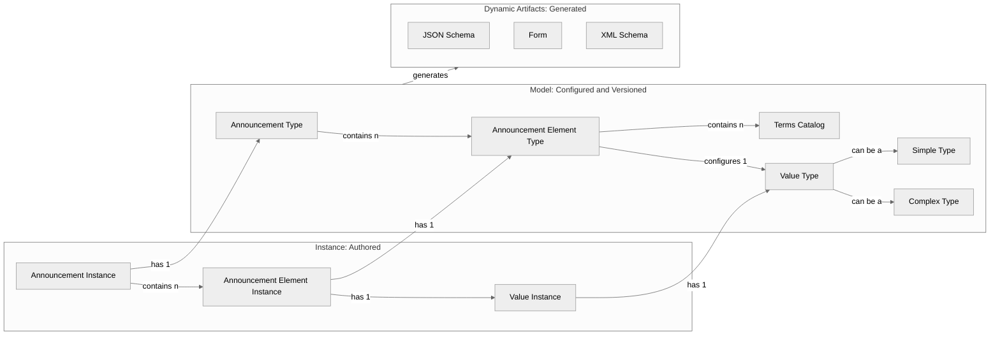

# Announcement Model #

## Overview ##

```mermaid
flowchart LR


%%{
  init: {
    'theme': 'neutral'
  }
}%%

%% ==== Instanz (rechts, orange) ====
subgraph Instance [Instance: Authored]
    AI[Announcement Instance]
    AEI[Announcement Element Instance]
    VI[Value Instance]

    AI -->|"contains n"| AEI
    AEI -->|"has 1"| VI
end


%% ==== Modell (Mitte, blau) ====
subgraph Model [Model: Configured and Versioned]
    AT[Announcement Type]
    AET[Announcement Element Type]
    C[Terms Catalog]
    VT[Value Type]
    ST[Simple Type]
    CT[Complex Type]

    AT -->|"contains n"| AET
    AET -->|"configures 1"| VT
    VT -->|"can be a"| ST
    VT -->|"can be a"| CT
    AET --> |"contains n"| C
end

%% ==== Dynamische Artefakte (links, lila) ====
subgraph DynamicArtifacts [Dynamic Artifacts: Generated]
    JSON[JSON Schema]
    FORM[Form]
    XML[XML Schema]
end

%% ==== Beziehungen Modell <-> Instanz ====
AI -->|"has 1"| AT
AEI -->|"has 1"| AET
VI -->|"has 1"| VT

%% ==== Beziehungen Modell <-> Dynamic Artifacts ====
Model --generates-->DynamicArtifacts

```
